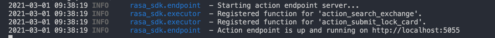
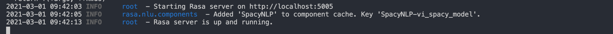
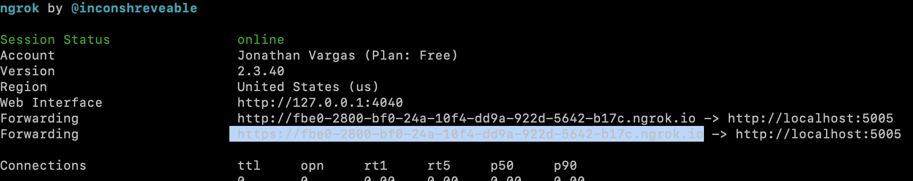

# react-native-rasa

A simple react native project integrated with Rasa Open Source with using REST Channel. Please see more at [Rasa Rest API](https://rasa.com/docs/rasa/connectors/your-own-website/#rest-channels).

This project uses [react-native-gifted-chat](https://github.com/FaridSafi/react-native-gifted-chat) so you can use all the props from it.

## Install

```
yarn add react-native-rasa
```

or

```
npm install react-native rasa
```

## Setup your Rasa host

The REST channel will provide you with a REST endpoint where you can post user messages and receive the assistant's messages in response.

Add the REST channel to your credentials.yml:

```yml
rest:
  # you don't need to provide anything here - this channel doesn't
  # require any credentials
```

Restart your Rasa X or Rasa Open Source server to make the REST channel available to receive messages. You can then send messages to `http://<host>:<port>/webhooks/rest/webhook`, replacing the host and port with the appropriate values from your running Rasa X or Rasa Open Source server.

## Message Format

Please see more informations from Rasa Doc at [here](https://rasa.com/docs/rasa/connectors/your-own-website/#rest-channels), you also need to know about [react-native-gifted-chat message format](https://github.com/FaridSafi/react-native-gifted-chat#message-object) to understand how this libray works.

## Rasa Example
### Installation

On the ***example-rasa*** folder there is a sample code using [poetry](https://python-poetry.org) and [Rasa 3.0.4](https://rasa.com/docs/rasa/). If you do not have poetry installed yet you can install it from [here](https://python-poetry.org/docs/#installation). It requires you have *python = ">=3.7,<3.9"* installed.

You can activate a python environment and install packages with the following commands. Make sure you are on ***example-rasa*** folder
```python
poetry shell
poetry install
```

### Running the Rasa and Action Server

At the root of your rasa project, run the following command to start the action server. It will be defaulted to port 5055.

```python
rasa train
rasa run actions
```

You should see the following output at the terminal


Open a new terminal and activate the same virtual environment with ***poetry shell***. Change to directory ***example-rasa***. Run the following command to start the server. The default port is 5005.

```python
rasa run --enable-api --cors "*"
```

`enable-api` is optional but `cors` is required to allow secure data transfer and prevent you from getting [Cross-Origin Resource Sharing error](https://developer.mozilla.org/en-US/docs/Web/HTTP/CORS/Errors). The terminal will show the following output. For Windows users, you need to use double quotes to ensure that CORS registered correctly.


### Running ngrok
Android and iOS apps will requiere secure ***https*** connections. If you are testing locally we recommend you to use [ngrok](https://ngrok.com/). You should copy the https address on **host** props.

```
./ngrok http 5005
```




### Basic chat configuration

```javascript
import React from 'react';
import {SafeAreaView, StatusBar, StyleSheet} from 'react-native';
import RNRasa from 'react-native-rasa';
// your rasa host, for example:
const HOST = 'http://localhost:5005';
const App = () => {
  return (
    <>
      <StatusBar barStyle="dark-content" />
      <SafeAreaView style={styles.container}>
        <RNRasa
          host={HOST}
          onSendMessFailed={(error) => console.log(error)}
          emptyResponseMessage="Sorry, I don't understand"
          onEmptyResponse={() => console.log('Handle with your custom action')}
        />
      </SafeAreaView>
    </>
  );
};

export default StyleSheet.create({
  container: {
    flex: 1,
  },
});
```

For a custom Chat setup, please check the **App.tsx** file.

## Props
- **`host`** _(string)_ - (Required) Your Rasa host, `http://<host>:<port>/webhooks/rest/webhook`, replacing the host and port with the appropriate values from your running Rasa X or Rasa Open Source server.
- **`onSendMessFailed`** _(Function)_ - (Optional) Callback when sending a message failed.
- **`onEmptyResponse`** _(Function)_ - (Optional) Callback when the bot return empty response (Sometimes it happened to Rasa Open Source).
- **`emptyResponseMessage`** _(String)_ - (Optional) The message the bot will return in case the reponse is empty.
- **`userId`** _(String)_ - (Optional) Set the user Id..
- **`userAvatar`** _(String)_ - (Optional) Set the user Avatar using an image uri.
- **`userName`** _(String)_ - (Optional) Set the user name.
- **`botName`** _(String)_ - (Optional) Set the bot name.
- **`botAvatar`** _(String)_ - (Optional) Set the bot Avatar using an image uri.


- You can also use all the props from [react-native-gifted-chat](https://github.com/FaridSafi/react-native-gifted-chat)

## Methods
- **`resetMessages`** _(Function)_ - This clear all messages on the widget.
- **`resetBot`** _(Function)_ - It sends a **reset** intent to Rasa server (It will requiere a correct configuration on Rasa server to handle this intent. Check how to do that on the our sample code).
- **`sendCustomMessage`** _(Function)_ - It allows to send custom text messages to Rasa server.

## Preview
  
<p align="center">
  
</p>

### TODO List:

- [x] Reset bot on destroy
- [x] Add restart bot options
- [x] Add checkbox messages and quick replies
- [x] Add bot avatar
- [x] Add example
- [x] Add Video reponses
- [ ] Voice support
- [ ] Allow that users attach files and images

PR are welcome ❤️

## License

  <a title='License' href="https://github.com/hungvu193/react-native-rasa/blob/master/LICENSE" height="18">
    
  </a>
